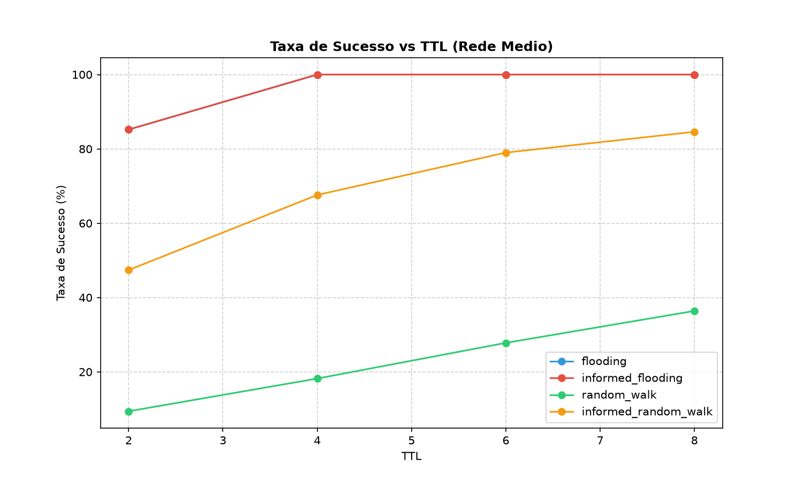
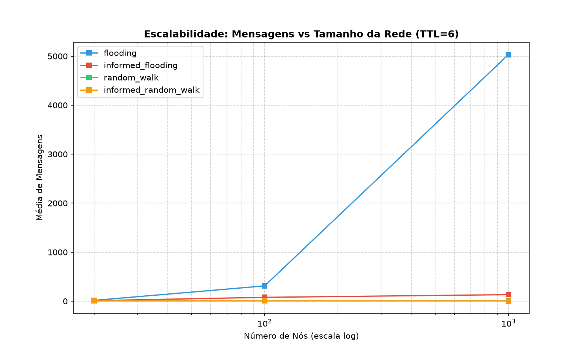
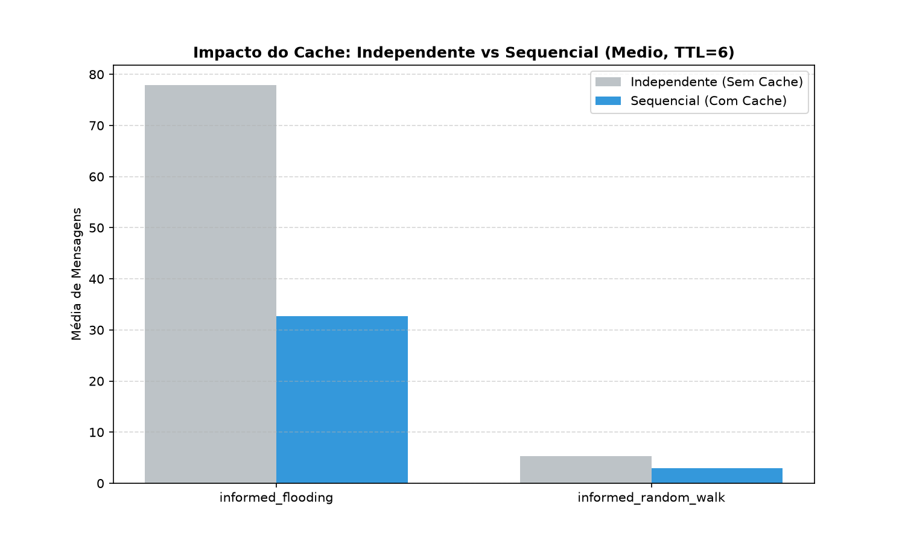
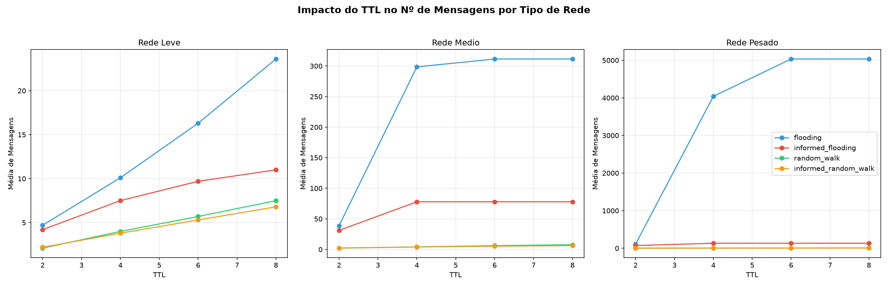
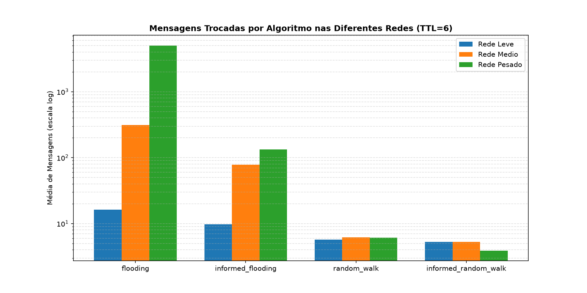

# Simulação e Análise de Algoritmos de Busca em Redes P2P

## Equipe
*   **Marcos Amorim**
*   **Pedro Vieira**
*   **Davi**
*   **Cainã**

---

## Escopo do Projeto
Este projeto realiza um estudo comparativo sobre a eficiência de diferentes estratégias de busca em redes Peer-to-Peer (P2P) não estruturadas. O foco é mensurar como o aumento do tamanho da rede, a variação do TTL e o uso de mecanismos de memória (cache/informação) impactam o tráfego de dados e a eficácia da localização de recursos.

---

## Algoritmos Usados
O simulador implementa quatro variações de busca, divididas em duas categorias principais:

### 1. Flooding
*   **Flooding Tradicional**: Propaga a requisição para todos os vizinhos conhecidos. É exaustivo e garante encontrar o recurso se ele estiver dentro do alcance do TTL, mas gera alto tráfego.
*   **Informed Flooding**: Utiliza um cache de índices de localização. Ao encontrar um recurso, o rastro é salvo nos nós intermediários. Se uma busca futura atingir um nó com essa informação, ela é resolvida via "atalho", reduzindo a propagação desnecessária.

### 2. Random Walk
*   **Random Walk Tradicional**: Encaminha a mensagem para apenas **um** vizinho escolhido aleatoriamente. É extremamente econômico em mensagens, mas possui baixa taxa de sucesso para TTLs baixos.
*   **Informed Random Walk**: Antes de cada salto aleatório, o nó consulta seus vizinhos imediatos (1-hop) e seu cache local. Se o recurso ou sua localização forem conhecidos na vizinhança, o algoritmo desvia o passeio diretamente para o alvo.

---

## Cenários de Teste / Carga
As redes foram configuradas para representar diferentes escalas de complexidade, variando o número de nós e a densidade de conexões (grau dos nós):

| Perfil | Nós | Densidade (Vizinhos) | Objetivo |
| :--- | :--- | :--- | :--- |
| **Leve** | 20 | 2 - 3 | Validação de lógica e visualização de grafos. |
| **Médio** | 100 | 5 - 10 | Cenário de operação regular. |
| **Pesado** | 1000 | 8 - 15 | Teste de estresse e análise de escalabilidade massiva. |

### Parâmetros de Simulação
*   **Rodadas**: 500 execuções por cenário para garantir relevância estatística.
*   **TTLs Testados**: [2, 4, 6, 8].
*   **Modos**: Independente (sem cache) vs. Sequencial (com cache acumulado).

---

## Resultados por Categoria

### 1. Taxa de Sucesso vs. TTL
Analisa a confiabilidade dos algoritmos. O Flooding atinge 100% de sucesso rapidamente, enquanto o Random Walk exige TTLs mais altos para cobrir a rede.

### 2. Escalabilidade e Impacto na Rede
O gráfico de escalabilidade utiliza escala logarítmica para mostrar como o Flooding se torna impraticável em redes de 1000 nós, enviando milhares de mensagens, enquanto o Random Walk mantém um custo constante.

### 3. Eficiência do Cache (Informed Search)
Comparativo entre o modo Independente e Sequencial. Demonstra como a inteligência distribuída reduz o número de mensagens necessárias para reencontrar recursos populares.

### 4. Sensibilidade ao TTL por Perfil de Rede
Mostra como cada topologia de rede (Leve, Média, Pesada) reage ao aumento do TTL em termos de volume de tráfego.

### 5. Comparativo Geral (Escala Logarítmica)
Visão consolidada do custo de cada algoritmo em todas as redes. A escala logarítmica é utilizada no eixo Y para permitir que o desempenho do Random Walk seja visível mesmo diante das magnitudes astronômicas do Flooding na rede Pesada.

---

## Conclusões
1.  **Custo do Flooding**: Em redes pesadas, o Flooding gera um tráfego de mensagens que pode saturar, sendo viável apenas com TTLs muito baixos.
2.  **Vantagem do Random Walk**: É a melhor opção para redes grandes onde o custo de mensagens é crítico, desde que o tempo de resposta (latência) não seja a prioridade máxima.
3.  **Sucesso da Cache**: O uso de cache provou ser o meio-termo ideal, oferecendo taxas de sucesso comparáveis ao Flooding com uma fração do custo de mensagens após o "aprendizado" da rede.
